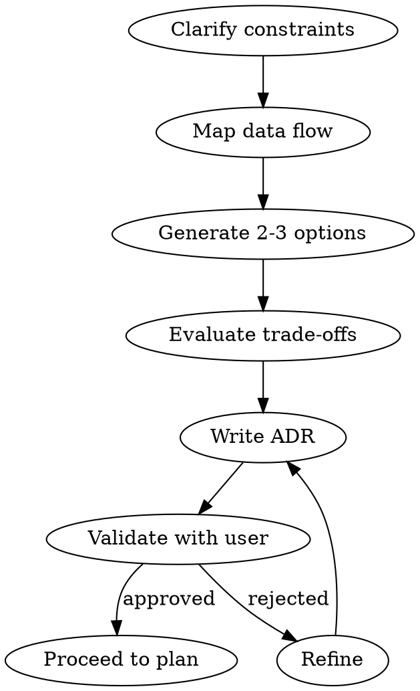

# Architect

## Overview

Architecture is the set of decisions that are **hard to reverse**. Make them consciously, with explicit trade-offs, before writing code. The goal is the **simplest design that satisfies current requirements** while keeping future options open at low cost.

## When to Use

- User asks "how should I build X" before writing code
- Multiple valid approaches exist with meaningful trade-offs
- System involves >2 moving parts (services, databases, queues)
- Performance, scaling, or reliability constraints are mentioned
- You're about to write scaffolding that will constrain future choices

**Do NOT use for:** Single-function changes, bug fixes, or features that fit cleanly into existing architecture.

## Core Process



### Step 1 — Clarify Constraints First

Before proposing anything, surface the real constraints:

| Dimension | Questions |
|-----------|-----------|
| **Scale** | Users/requests/records now? In 1 year? |
| **Latency** | Acceptable p99? Real-time or eventual? |
| **Consistency** | Can users see stale data? For how long? |
| **Team** | Engineers? Existing expertise? |
| **Ops** | On-call? Observability tooling? Deployment pipeline? |
| **Budget** | Cloud spend ceiling? Build vs buy? |

**Do not skip this.** Wrong assumptions produce wrong architectures.

### Step 2 — Map Data Flow (Not Components)

1. What data enters the system?
2. What transforms it?
3. What queries it?
4. What changes trigger what effects?

### Step 3 — Generate Options (2-3 Max)

A single-option proposal is a recommendation disguised as architecture. For each option:
- One-line description
- Why it's valid here
- Key trade-offs (cost, complexity, ops burden, team fit)

### Step 4 — Evaluate Trade-offs

| Option | Simplicity | Ops burden | Team fit | Reversibility | Score |
|--------|-----------|------------|----------|--------------|-------|
| A      | /3        | /3         | /3       | /3           | /12   |
| B      | /3        | /3         | /3       | /3           | /12   |

**Reversibility matters most early.** Prefer options that don't foreclose alternatives.

### Step 5 — Write the ADR

```markdown
## Decision: <what was decided>
**Context:** <problem + constraints>
**Options considered:** <brief list>
**Decision:** <chosen option>
**Rationale:** <why this one>
**Trade-offs accepted:** <what you're giving up>
**Revisit when:** <triggering condition to reconsider>
```

Show the ADR to the user before any code is written. Architecture approved in conversation is architecture understood.

## Pattern Quick Reference

| Pattern | Use when | Avoid when |
|---------|----------|------------|
| **Monolith** | Team <5, early product, unclear boundaries | Independent scaling needed, multiple teams |
| **Modular monolith** | Clear domain boundaries, team <10, deployment coupling OK | Org requires separate deploys |
| **Microservices** | Independent scaling, team >10, clear domain ownership | Early stage, small team, no service mesh |
| **Event-driven** | Decoupling producers/consumers, audit trail, fan-out | Strong consistency required, simple CRUD |
| **CQRS** | Read/write ratio >10:1, complex queries, audit | Simple domain, small team |
| **Saga** | Distributed transactions across services | Single-service transactions |
| **Read replica** | Read-heavy, reporting, analytics | Real-time consistency required |
| **Cache-aside** | Frequently read, rarely changed data | Data changes frequently, invalidation is complex |
| **BFF** | Multiple clients (web/mobile) with different data shapes | Single client type |

## Non-Functional Checklist

Before finalizing any design:

- [ ] **Observability**: How will you know when it's broken? (logs, metrics, traces)
- [ ] **Failure modes**: What happens when each dependency is down?
- [ ] **Data migrations**: How does schema evolve without downtime?
- [ ] **Security boundaries**: Where is auth enforced? Blast radius of a breach?
- [ ] **Deployment**: Blue/green? Feature flags? Rollback procedure?
- [ ] **Local dev**: Can a new engineer run this in <15 minutes?

## Common Mistakes

| Mistake | Fix |
|---------|-----|
| Designing for 100x current scale | Design for 10x; re-architecture is cheaper than premature complexity |
| Microservices from day 1 | Start monolith; extract services when team/domain boundaries become painful |
| Skipping ADRs | Future engineers will re-litigate every decision without them |
| Ignoring ops burden | A design your team can't operate at 3am is a bad design |
| Treating all data as equal | Profile access patterns first — hot vs cold data needs different storage |
| Shared DB between services | If two services share a database, they are one service |
| Synchronous calls across trust boundaries | Use async + retry for external calls; fail fast for internal |

## Example ADR

```markdown
## Decision: PostgreSQL + JSONB for user profiles, not MongoDB

**Context:** Profiles have flexible schema (nested preferences) but we need
relational queries (joins with orders, billing). Team has strong SQL expertise.
Scale: 500k users growing to 2M in 18 months.

**Options considered:**
- MongoDB: flexible schema, horizontal scale
- PostgreSQL + JSONB: relational + flexible columns
- PostgreSQL normalized: pure relational

**Decision:** PostgreSQL + JSONB for preference blobs, normalized for core fields.

**Rationale:** Team SQL expertise, existing PG infra, JSONB handles schema
flexibility without sacrificing joins. 2M rows fits on a single PG instance
with read replicas.

**Trade-offs accepted:** JSONB queries slower than normalized for deep nesting;
schema migrations require care.

**Revisit when:** >10M users OR preference queries become a measurable bottleneck.
```

## Notes

- The best architecture is the one your team can operate at 3am.
- "Simple" is a feature. Complexity has a carrying cost every sprint.
- Never present one option. Always present the alternatives you considered and rejected.
