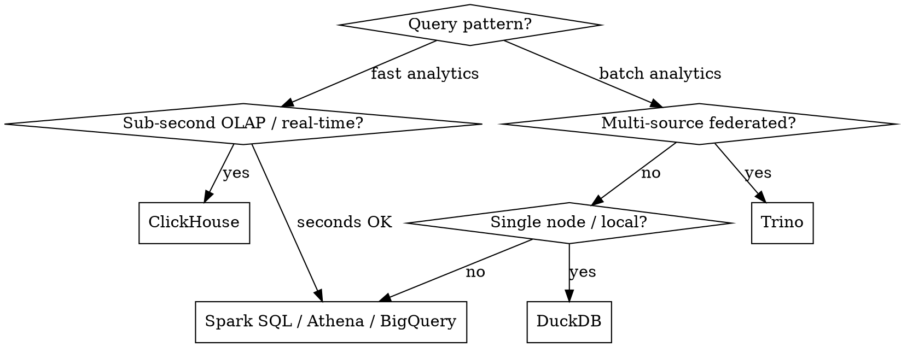

# Big Data Dev

**REQUIRED BACKGROUND:** Apply principles from `senior-dev` first.
**Language skills:** Use `scala-senior-dev` for Spark Scala (preferred), `python-senior-dev` for PySpark, `java-senior-dev` for JVM tooling. Scala is the primary language for Spark — use it unless the team is Python-first.

## Overview

Big data engineering is distributed systems applied to data. The failure modes are different from regular software: **data skew kills jobs silently, shuffle is the enemy of performance, and small files are death by a thousand cuts**. Design for the data shape first, then the compute.

## Language Choice for Spark

| Language | Use when |
|----------|----------|
| **Scala** | New Spark jobs, performance-critical paths, native Dataset/DataFrame API, complex transformations |
| **Python (PySpark)** | Data science teams, ML pipelines, pandas interop, existing Python codebase |
| **Java** | Legacy corporate standard, Kafka Streams, Flink jobs |

Scala gives you compile-time type safety with the Dataset API and zero serialization overhead vs Python UDFs.

---

## Apache Spark

### Core Abstractions

```
RDD (avoid in new code)
  └── DataFrame (dynamic typing, SQL-like)
        └── Dataset[T] (compile-time typed, Scala/Java only) ← prefer this
```

**Always prefer Dataset[T] in Scala** — the compiler catches schema mismatches before the job runs.

```scala
// ❌ DataFrame — schema errors at runtime
val df = spark.read.parquet("s3://bucket/events")
df.select("evnt_typ")  // typo discovered at runtime, not compile time

// ✅ Dataset[T] — schema is a contract
case class Event(eventType: String, userId: Long, ts: Long)
val events: Dataset[Event] = spark.read.parquet("s3://bucket/events").as[Event]
// compile error if field doesn't exist
```

### Transformations vs Actions

```
Transformations (lazy): map, filter, groupBy, join, union, select
Actions (trigger execution): count, show, write, collect, take
```

- **Never call `.collect()` on large datasets** — brings all data to driver, causes OOM
- Chain transformations, trigger one action
- `.cache()` / `.persist()` only when the same Dataset is used in multiple actions; unpersist after

### Partitioning

Partitioning is the single most impactful performance decision.

```scala
// Reading: control input parallelism
spark.read.option("maxFilesPerTrigger", 100).parquet(path)

// Repartition vs Coalesce
// repartition(n)  — full shuffle, use to increase partitions or balance skew
// coalesce(n)     — no shuffle, use only to reduce partitions before write

// Writing: control output file count
events
  .repartition(200)           // match your cluster's parallelism
  .write
  .partitionBy("date", "region")  // partition pruning for queries
  .parquet(outputPath)

// Rule of thumb: partition size 128MB–1GB; ~2–4x partitions vs cores
val targetPartitions = (inputSizeGB * 1024 / 256).toInt.max(sc.defaultParallelism * 2)
```

### Shuffle — The Enemy

Every `groupBy`, `join`, `distinct`, `repartition` triggers a shuffle. Minimize them.

```scala
// ❌ Double shuffle
df.groupBy("userId").agg(sum("amount"))
  .join(users, "userId")

// ✅ Single shuffle: join first, then aggregate
df.join(users, "userId")
  .groupBy("userId", "userName")
  .agg(sum("amount"))

// ✅ Broadcast join — eliminates shuffle entirely for small tables (<= 10MB by default)
import org.apache.spark.sql.functions.broadcast
largeEvents.join(broadcast(smallLookup), "productId")

// Tune broadcast threshold
spark.conf.set("spark.sql.autoBroadcastJoinThreshold", 50 * 1024 * 1024)  // 50MB
```

### Data Skew

Skew = some partitions have 10-100x more data than others. Symptoms: most tasks finish in 2s, 1-2 tasks take 10 min.

```scala
// Diagnose: check partition sizes
df.groupBy(spark_partition_id()).count().orderBy(desc("count")).show()

// Fix 1: salting for groupBy skew
import org.apache.spark.sql.functions._
val salt = (rand() * 50).cast("int")
val salted = skewedDf
  .withColumn("salt", salt)
  .groupBy("skewedKey", "salt")
  .agg(sum("value").as("partial"))
  .groupBy("skewedKey")
  .agg(sum("partial").as("total"))

// Fix 2: skew hint (Spark 3.x AQE)
spark.conf.set("spark.sql.adaptive.enabled", true)
spark.conf.set("spark.sql.adaptive.skewJoin.enabled", true)
```

### Adaptive Query Execution (AQE) — Enable Always in Spark 3+

```scala
spark.conf.set("spark.sql.adaptive.enabled", true)
spark.conf.set("spark.sql.adaptive.coalescePartitions.enabled", true)
spark.conf.set("spark.sql.adaptive.skewJoin.enabled", true)
```

---

## Storage Formats

| Format | Use when |
|--------|----------|
| **Parquet** | Default for analytics — columnar, splittable, good compression |
| **ORC** | Hive-heavy ecosystems, slightly better for row filters |
| **Delta Lake** | ACID transactions, upserts, time travel, schema evolution |
| **Apache Iceberg** | Multi-engine (Spark + Flink + Trino + Athena), hidden partitioning, partition evolution, row-level deletes |
| **Avro** | Row format, Kafka messages, schema registry |
| **Apache Arrow** | In-memory columnar format — zero-copy data exchange between engines |
| **JSON/CSV** | Input only at boundaries — prefer columnar formats for storage; avoid raw JSON at scale |

**Default choice:** Parquet for read-only data lakes, Delta Lake or Iceberg for mutable/lakehouse patterns.

### Apache Arrow — In-Memory Columnar Format

Arrow is not a storage format — it's an **in-memory columnar format** for zero-copy data exchange between systems without serialization.

```python
import pyarrow as pa
import pyarrow.parquet as pq

# ✅ Read Parquet into Arrow — stays columnar in memory
table = pq.read_table("data.parquet", columns=["user_id", "amount"])

# ✅ Zero-copy exchange: Arrow → pandas (no data copy)
df = table.to_pandas()

# ✅ Arrow Flight — high-throughput data transfer between services
# Used by: DuckDB, Polars, Spark (Arrow-based shuffle), pandas 2.x
```

**Where Arrow matters in big data:**
- **PySpark ↔ Python** — enable Arrow-based columnar transfer: `spark.conf.set("spark.sql.execution.arrow.pyspark.enabled", "true")` — eliminates row-by-row serialization overhead
- **Pandas UDFs in PySpark** — require Arrow enabled; operate on Arrow batches, not individual rows
- **DuckDB / Polars** — Arrow-native engines; read Parquet directly without Spark for single-node analytics
- **ADBC (Arrow Database Connectivity)** — replaces JDBC/ODBC for analytics databases; Arrow-native data transfer

**Rule:** Enable Arrow in PySpark always. For single-node analytics on data < 100GB, DuckDB + Arrow + Parquet is faster and cheaper than spinning up a Spark cluster.

### Delta Lake vs Apache Iceberg

| | Delta Lake | Apache Iceberg |
|-|-----------|----------------|
| **Engine support** | Spark-native, Flink (read), Trino | Spark, Flink, Trino, Athena, Hive — truly multi-engine |
| **Partition evolution** | Requires rewrite | Hidden partitioning + partition evolution with no rewrites |
| **Row-level deletes** | Merge-on-read or copy-on-write | Copy-on-write or merge-on-read (configurable per table) |
| **Schema evolution** | Supported | Supported + column renaming without rewrite |
| **Metadata** | Transaction log (JSON) | Metadata tree (Avro + Parquet manifests) — scales to billions of files |
| **Best for** | Databricks-heavy stacks | Multi-engine, cloud-native, Flink + Spark mixed |

**Choose Iceberg** when multiple engines (Spark + Flink + Trino) write and read the same tables, or when table scale is extreme (billions of files). **Choose Delta** when the stack is Databricks/Spark-only and operational simplicity matters.

### Small Files Problem

Small files (< 128MB) cause excessive metadata overhead and slow reads. Always compact.

```scala
// ❌ Default write produces hundreds of tiny files
df.write.parquet(path)

// ✅ Compact before writing
df.coalesce(targetFiles)
  .write
  .parquet(path)

// Delta Lake: auto-optimize + Z-ordering
deltaTable.optimize().executeZOrderBy("userId", "date")

// Or configure auto-compaction
spark.conf.set("spark.databricks.delta.autoCompact.enabled", true)
spark.conf.set("spark.databricks.delta.optimizeWrite.enabled", true)
```

---

## Blob Storage (Data Lake Infrastructure)

All big data platforms store raw and processed data in cloud object storage. Treat it as the single source of truth.

| Store | Cloud | Key SDK |
|-------|-------|---------|
| **Amazon S3** | AWS | `s3a://` (Hadoop), `boto3` (Python), AWS SDK |
| **Azure Data Lake Storage Gen2 (ADLS2)** | Azure | `abfss://` (Hadoop), `azure-storage-blob` |
| **Google Cloud Storage (GCS)** | GCP | `gs://` (Hadoop), `google-cloud-storage` |
| **MinIO** | On-prem / self-hosted | S3-compatible API |

### Access Patterns and Gotchas

```python
# ✅ Spark reading from S3 — use s3a://, not s3://
spark.read.parquet("s3a://bucket/prefix/")

# ✅ Partition discovery — enable for Hive-style partitioned data
spark.read.option("basePath", "s3a://bucket/events/") \
    .parquet("s3a://bucket/events/date=2024-03-*/")

# ✅ S3 consistency — strong read-after-write since 2020; no need for s3guard
# ✅ Use instance profiles / workload identity — never hardcode credentials
```

**Rules:**
- Always use directory paths ending in `/` — object stores are not real filesystems
- Avoid `rename()` on large files — object stores implement rename as copy+delete (very slow)
- Use `_SUCCESS` marker files for Hadoop-compatible job success signaling, not file presence
- Enable server-side encryption (SSE-S3 / SSE-KMS) for all buckets with PII
- Lifecycle policies: raw → 30d → Glacier; processed → 90d; never delete unpartitioned data without audit

### Data Lake Zones

```
raw/          ← exact copy of source data, immutable, append-only
  source=crm/
  source=kafka/
staging/      ← cleaned, deduplicated, validated; partitioned by date
processed/    ← transformed, enriched, joined; Iceberg/Delta tables
serving/      ← aggregated, denormalized for BI/ML consumption
```

---

## Streaming (Spark Structured Streaming / Flink / Kafka Streams)

```scala
// ✅ Structured Streaming — same Dataset API as batch
val stream = spark.readStream
  .format("kafka")
  .option("kafka.bootstrap.servers", brokers)
  .option("subscribe", "events")
  .load()
  .selectExpr("CAST(value AS STRING) as json")
  .select(from_json(col("json"), schema).as("data"))
  .select("data.*")

// Windowed aggregation
stream
  .withWatermark("eventTime", "10 minutes")
  .groupBy(window(col("eventTime"), "1 hour"), col("userId"))
  .agg(count("*").as("eventCount"))
  .writeStream
  .outputMode("append")
  .format("delta")
  .option("checkpointLocation", checkpointPath)
  .start()
```

**Spark Structured Streaming rules:**
- Always set **watermarks** for event-time windows — without them, state grows unbounded
- Use **append** output mode for aggregations with watermarks; **complete** only for small aggregations
- **Checkpoint location** is mandatory for fault tolerance — never skip it
- Prefer **Delta Lake / Iceberg** as sink for exactly-once semantics

---

### Apache Flink

Use Flink when you need **true streaming** (event-by-event, sub-second latency), complex stateful operators, or unified batch + stream pipelines with Iceberg.

```java
// Flink DataStream API (Java/Scala)
StreamExecutionEnvironment env = StreamExecutionEnvironment.getExecutionEnvironment();
env.setStreamTimeCharacteristic(TimeCharacteristic.EventTime);

DataStream<Event> stream = env
    .addSource(new FlinkKafkaConsumer<>("events", new EventSchema(), kafkaProps))
    .assignTimestampsAndWatermarks(
        WatermarkStrategy.<Event>forBoundedOutOfOrderness(Duration.ofSeconds(5))
            .withTimestampAssigner((e, ts) -> e.getTimestamp())
    );

// Keyed window aggregation
stream
    .keyBy(Event::getUserId)
    .window(TumblingEventTimeWindows.of(Time.minutes(1)))
    .aggregate(new CountAggregate())
    .addSink(new FlinkKafkaProducer<>("output", new ResultSchema(), kafkaProps));

env.execute("Event Count Pipeline");
```

**Flink vs Spark Streaming:**

| | Flink | Spark Structured Streaming |
|-|-------|---------------------------|
| **Latency** | Milliseconds (true streaming) | Seconds (micro-batch) |
| **State management** | RocksDB-backed, large state OK | In-memory, limited state |
| **Throughput** | High | Very high |
| **Iceberg / table formats** | First-class write support | Good |
| **SQL** | Flink SQL (strong) | Spark SQL (stronger) |
| **Ops complexity** | Higher | Lower (same cluster as batch) |

**Choose Flink** when latency < 1s is required, state is large (session windows, ML features), or you write to Iceberg from streaming. **Choose Spark Structured Streaming** when you already run Spark for batch and latency of a few seconds is acceptable.

**Flink rules:**
- Always configure **checkpointing** (`env.enableCheckpointing(60_000)`) — without it, failure means replaying from the beginning
- Use **RocksDB state backend** for large keyed state; heap backend only for small state
- Set **parallelism explicitly** — never rely on default
- Use **Flink SQL** for declarative pipelines; reserve DataStream API for custom operators

---

### Kafka Streams

Use Kafka Streams for **lightweight stateful stream processing** embedded in a Java/Scala microservice — no separate cluster needed.

```java
StreamsBuilder builder = new StreamsBuilder();

KStream<String, Order> orders = builder.stream("orders",
    Consumed.with(Serdes.String(), orderSerde));

// Stateful aggregation with KTable
KTable<String, Long> orderCounts = orders
    .filter((key, order) -> order.getStatus().equals("PLACED"))
    .groupBy((key, order) -> order.getCustomerId())
    .count(Materialized.as("order-counts-store"));

orderCounts.toStream().to("order-counts-output",
    Produced.with(Serdes.String(), Serdes.Long()));

KafkaStreams streams = new KafkaStreams(builder.build(), config);
streams.start();
```

**When to use Kafka Streams vs Flink:**

| Kafka Streams | Flink |
|--------------|-------|
| Embedded in service, no infra | Separate cluster required |
| Kafka-only sources/sinks | Any source/sink |
| Small-medium state | Large state (RocksDB at scale) |
| Simple topologies | Complex multi-stream joins |
| Java/Kotlin teams | Java/Scala teams |

**Kafka Streams rules:**
- Always set `processing.guarantee = exactly_once_v2` for financial/critical pipelines
- Use `GlobalKTable` for small reference data lookups (replicated to every instance)
- `KTable` for changelog streams (compacted topics); `KStream` for event streams
- Schema Registry + Avro/Protobuf for all message schemas — never raw JSON in production

---

## Data Modeling

| Model | Use when |
|-------|----------|
| **Star schema** | BI/reporting, Hive/Spark SQL, well-understood query patterns |
| **Data vault** | Auditable, source-of-truth layer, many source systems |
| **One Big Table (OBT)** | Denormalized read optimization, Lakehouse query layer |
| **Event sourcing** | Audit trail, replayable history, temporal queries |

**Partition key selection:**
- Partition by columns used in `WHERE` filters most often (date, region, tenant)
- Never partition by high-cardinality columns (userId, UUID) — creates millions of tiny partitions
- 3-4 partition columns maximum

---

## Query Engines

Query engines sit on top of your data lake/lakehouse and serve SQL to BI tools, analysts, and APIs. They do **not** run your pipelines — they query data in place.

| Engine | Use when |
|--------|----------|
| **Trino (PrestoSQL)** | Federated queries across S3 + RDBMS + Kafka; ad-hoc analytics; Iceberg/Delta support |
| **Apache Spark SQL** | Already running Spark; large-scale batch queries; tight Iceberg/Delta integration |
| **ClickHouse** | Sub-second OLAP queries; real-time analytics; high write throughput from Kafka |
| **DuckDB** | Single-node analytics; local development; Parquet/Arrow/S3 queries without a cluster |
| **Amazon Athena** | Serverless queries on S3; Iceberg support; pay-per-scan; no cluster management |
| **Google BigQuery** | GCP-native; serverless; excellent for large joins; columnar storage managed automatically |
| **Apache Hive** | Legacy; avoid for new projects — use Trino or Spark SQL instead |

### Decision Guide



**Key rules:**
- Trino and ClickHouse are read engines — don't use them for ETL pipelines (use Spark/Flink)
- ClickHouse ingests directly from Kafka via `MaterializedView` + Kafka engine table — great for real-time dashboards
- DuckDB can query S3 Parquet directly — use it for fast iteration before scaling to Spark
- Always use a **data catalog** (Hive Metastore, AWS Glue, Unity Catalog, Nessie) as the schema registry so all engines share table definitions

---

## Orchestration

Choose your orchestrator based on team Python fluency, operational complexity, and whether you need asset-centric or task-centric modeling.

| Tool | Model | Use when |
|------|-------|----------|
| **Apache Airflow** | Task DAGs | Mature team, rich operator ecosystem, existing Airflow infra, cron-style scheduling |
| **Dagster** | Asset DAGs | Asset lineage matters, data-aware scheduling, type-safe pipelines, better testing story |
| **Prefect** | Flow + task | Simpler ops than Airflow, dynamic workflows, cloud-managed option |
| **Argo Workflows** | K8s-native DAGs | Kubernetes shop, container-per-task isolation, complex dependency graphs |

### Airflow — Key Rules

```python
# ❌ Logic inside DAG file — pollutes scheduler parse time
@dag
def my_pipeline():
    @task
    def process():
        import pandas as pd          # heavy imports at task level, not DAG level
        df = pd.read_parquet(path)   # ← correct: import inside task
        ...

# ✅ Keep DAG files thin — only wiring, no business logic
# Business logic → operators / hooks / separate modules

# ❌ Dynamic task count that changes on every parse
with DAG(...) as dag:
    for item in db.query("SELECT ..."):   # DB call on every scheduler parse!
        ...

# ✅ Use Dynamic Task Mapping (Airflow 2.3+)
@task
def get_items(): return fetch_items_once()

@task
def process(item): ...

process.expand(item=get_items())
```

**Airflow pitfalls:**
- Never do I/O or slow imports at DAG file top level — the scheduler parses every file every heartbeat
- Use `execution_date` / `data_interval_start` for idempotent backfills, not `datetime.now()`
- Set `max_active_runs` and `catchup=False` on new DAGs to prevent backfill floods
- Use `KubernetesPodOperator` or `DockerOperator` for Spark/heavy jobs — not `BashOperator` + SSH

### Dagster — Key Rules

```python
# ✅ Assets are the primary abstraction — not tasks
@asset(partitions_def=DailyPartitionsDefinition(start_date="2024-01-01"))
def raw_events(context: AssetExecutionContext) -> pd.DataFrame:
    return read_events(context.partition_key)  # partition_key = "2024-03-15"

@asset(deps=[raw_events])
def cleaned_events(raw_events: pd.DataFrame) -> pd.DataFrame:
    return raw_events.dropna()

# ✅ Type-check outputs with IOManagers — assets are typed, not just blobs
# ✅ Sensors + asset conditions replace cron for data-driven scheduling
# ✅ Resources for external connections (db, S3) — injected, not hardcoded
```

**Dagster pitfalls:**
- Don't use `ops` + `graphs` for new projects — use `assets` (Dagster's first-class model)
- Partition definitions must be consistent — changing them requires rematerializing affected assets
- Keep `@asset` functions pure where possible — side effects belong in resources

---

## Data Transformation (dbt)

dbt is the SQL transformation layer. It runs inside your warehouse — not in Spark or Python. Use it for the **T in ELT** (after data lands in the warehouse).

### When to use dbt vs Spark

| Concern | Use dbt | Use Spark |
|---------|---------|-----------|
| SQL transformations in warehouse | ✅ | ❌ |
| Python UDFs, ML feature engineering | ❌ | ✅ |
| Sub-second latency | ❌ | ❌ (use serving DB) |
| Data volume fits in warehouse | ✅ | — |
| Cross-system joins (S3 + Kafka) | ❌ | ✅ |

### dbt Project Structure

```
models/
  staging/        ← 1:1 with source tables, light cleaning only
    stg_orders.sql
  intermediate/   ← business logic, joins, deduplication
    int_order_items.sql
  marts/          ← final consumption layer (star schema, OBT)
    fct_orders.sql
    dim_customers.sql
```

**Rules:**
- `staging` models are 1:1 with sources — no joins, no business logic
- `marts` models are the contract with BI/analysts — stable column names, documented
- Never reference `raw` source tables directly in `marts` — always go through `staging`

### dbt Model Materializations

| Materialization | Use when |
|----------------|----------|
| `view` | Lightweight, frequently changing, small data |
| `table` | Slow query base, snapshot of point-in-time |
| `incremental` | Large tables, append or upsert pattern |
| `snapshot` | SCD Type 2 — track row history over time |

```sql
-- ✅ Incremental model — only process new rows
{{ config(materialized='incremental', unique_key='order_id') }}

SELECT
    order_id,
    customer_id,
    total_amount,
    created_at
FROM {{ ref('stg_orders') }}


WHERE created_at > (SELECT MAX(created_at) FROM {{ this }})

```

### dbt Testing

```yaml
# schema.yml — column-level and model-level tests
models:
  - name: fct_orders
    columns:
      - name: order_id
        tests:
          - unique
          - not_null
      - name: status
        tests:
          - accepted_values:
              values: ['placed', 'shipped', 'cancelled']
      - name: customer_id
        tests:
          - relationships:
              to: ref('dim_customers')
              field: customer_id
```

Run `dbt test` in CI on every PR. A broken constraint in a mart model is a data incident.

### dbt + Orchestration

```
Airflow:  DbtTaskGroup / BashOperator running dbt CLI
Dagster:  dagster-dbt — dbt models become Dagster assets automatically
Prefect:  prefect-dbt
```

**Prefer Dagster + dbt** for new stacks — dbt models surface as Dagster assets, giving you lineage, observability, and data-aware scheduling out of the box.

---

## Performance Checklist

Before submitting any Spark job to production:

- [ ] AQE enabled (`spark.sql.adaptive.enabled = true`)
- [ ] Broadcast join used for all tables < 50MB
- [ ] No `.collect()` on large datasets
- [ ] Partition count ~2-4x total cores; partition size 128MB–1GB
- [ ] Output compacted — no small files
- [ ] Skew investigated for joins/groupBys on known skewed keys
- [ ] `.cache()` used only where Dataset is reused; `.unpersist()` called after
- [ ] Watermarks set on all streaming aggregations
- [ ] Checkpoint path set for all streaming queries

---

## Common Pitfalls

| Pitfall | Fix |
|---------|-----|
| `.collect()` on large data | Use `.take(n)`, `.show()`, or write to storage |
| UDFs in PySpark for simple transforms | Use built-in Spark SQL functions — UDFs break Catalyst optimizer |
| Cartesian join (no join key) | Always inspect query plan with `.explain(true)` before running |
| Writing without partitioning | Always `partitionBy` on the most common filter column |
| Re-reading same data multiple times | `.cache()` + reuse, or materialize intermediate results |
| Wrong number of partitions | Profile with Spark UI; tune `spark.sql.shuffle.partitions` (default 200 is rarely right) |
| Ignoring data types | `StringType` for everything kills performance; use native types |
| Schema inference on JSON/CSV in production | Define schema explicitly — inference scans whole file and is wrong for nulls |
| No watermark on streaming | State accumulates until OOM |
| Mixing batch and streaming logic | Keep them separate; share transformation functions, not pipelines |

## Notes

- Always check the Spark UI (stages, tasks, shuffle read/write, skew) before declaring a job healthy
- `spark.sql.shuffle.partitions` defaults to 200 — set it to `2-4x total cores` for your cluster
- The query plan (`.explain("formatted")`) tells you everything: broadcast joins, filters pushed down, shuffles
- Delta Lake's time travel (`VERSION AS OF`, `TIMESTAMP AS OF`) is invaluable for debugging bad writes
- In Scala, use the Dataset API typed transformations — fall back to DataFrame/SQL only when the typed API is awkward (e.g., complex pivot operations)
