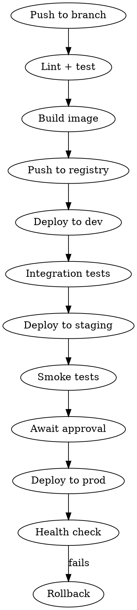
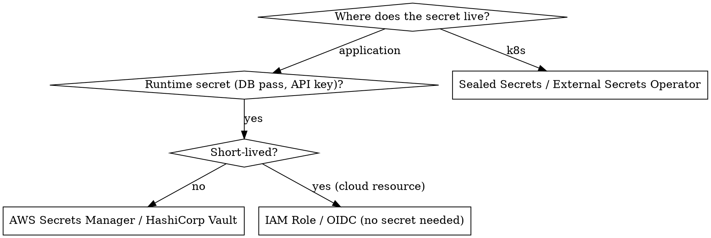

# Senior DevOps

**REQUIRED BACKGROUND:** Apply all principles from `senior-dev` first. Infrastructure code has the same quality bar as application code — it must be readable, testable, and reviewable.

## Overview

Senior DevOps is not about knowing every tool — it's about **treating infrastructure as software**: versioned, reviewed, tested, and observable. The failure modes are different: a bad Terraform change can destroy production state; an unmonitored service silently degrades. Design for reversibility, least privilege, and observability from day one.

---

## Infrastructure as Code

### Terraform vs Pulumi

| | Terraform (HCL) | Pulumi |
|-|-----------------|--------|
| **Language** | HCL (domain-specific) | Python, TypeScript, Go, Java, .NET |
| **State** | Remote backend (S3, TFC) | Pulumi Cloud or self-managed |
| **Testing** | `terraform validate`, `checkov`, `terratest` | Native unit tests in host language |
| **Maturity** | Very mature, huge provider ecosystem | Growing, strong for complex logic |
| **Best for** | Standard infra, strong HCL skills, existing TF codebase | Complex dynamic infra, prefer general-purpose languages |

**Choose Terraform** for most teams — ecosystem is unmatched. **Choose Pulumi** when infrastructure logic is complex enough that HCL becomes painful (loops, conditionals, abstractions).

---

### Terraform — Senior Patterns

#### Module Structure

```
infra/
  modules/
    vpc/              ← reusable, versioned modules
      main.tf
      variables.tf
      outputs.tf
    eks-cluster/
    rds/
  environments/
    dev/
      main.tf         ← calls modules with env-specific vars
      backend.tf
    staging/
    prod/
```

**Rules:**
- Modules must have explicit `variables.tf` (inputs) and `outputs.tf` (exports) — no implicit coupling
- Never hardcode region, account ID, or environment name inside a module
- Pin provider versions: `version = "~> 5.0"` — never `version = ">= 1.0"`
- Use `terraform.tfvars` for non-secret values; secrets via environment variables or Vault

#### State Management

```hcl
# ✅ Remote state with locking — never use local state in shared environments
terraform {
  backend "s3" {
    bucket         = "my-tf-state"
    key            = "prod/vpc/terraform.tfstate"
    region         = "us-east-1"
    encrypt        = true
    dynamodb_table = "tf-state-lock"  # prevents concurrent applies
  }
}

# ✅ Cross-stack references via remote state outputs
data "terraform_remote_state" "vpc" {
  backend = "s3"
  config = {
    bucket = "my-tf-state"
    key    = "prod/vpc/terraform.tfstate"
    region = "us-east-1"
  }
}

resource "aws_eks_cluster" "this" {
  vpc_config {
    subnet_ids = data.terraform_remote_state.vpc.outputs.private_subnet_ids
  }
}
```

#### Terraform Pitfalls

| Pitfall | Fix |
|---------|-----|
| `terraform apply` without `plan` review | Always `plan` → review → `apply`; in CI, store plan artifact |
| Storing secrets in `.tfvars` or state | Use `sensitive = true`; never output secrets; use Vault/SSM |
| Monolithic state file | Split by lifecycle (network, compute, data) — slow blast radius |
| No `prevent_destroy` on critical resources | Add `lifecycle { prevent_destroy = true }` to databases, state buckets |
| Drift from manual console changes | `terraform plan` in CI on schedule to detect drift |
| Ignoring `terraform fmt` | Enforce in CI: `terraform fmt -check` |

---

### Terragrunt — DRY Terraform at Scale

Use Terragrunt when managing multiple environments/accounts with the same modules.

```
infra/
  terragrunt.hcl          ← root: common remote state config
  _modules/               ← pinned Terraform modules
  dev/
    terragrunt.hcl        ← env-level: common vars for dev
    vpc/
      terragrunt.hcl      ← calls module, passes env vars
    eks/
      terragrunt.hcl
  prod/
    terragrunt.hcl
    vpc/
      terragrunt.hcl
```

```hcl
# _modules/vpc/terragrunt.hcl
terraform {
  source = "git::https://github.com/org/modules.git//vpc?ref=v1.2.0"
}

dependency "common" {
  config_path = "../common"
}

inputs = {
  env        = local.env
  cidr_block = "10.0.0.0/16"
  vpc_name   = "main-${local.env}"
}
```

**Terragrunt rules:**
- Always pin module `ref` to a tag — never `?ref=main`
- Use `dependency` blocks for cross-module outputs — not data sources
- `run-all apply` in CI only after `run-all plan` is reviewed
- Keep `inputs` minimal — complex logic belongs in the module, not the Terragrunt config

---

### Pulumi — Senior Patterns

```typescript
// ✅ Typed, composable, testable
import * as aws from "@pulumi/aws";
import * as pulumi from "@pulumi/pulumi";

const config = new pulumi.Config();
const env = pulumi.getStack();  // "dev", "staging", "prod"

// Reusable component with typed inputs
class AppCluster extends pulumi.ComponentResource {
    public readonly clusterArn: pulumi.Output<string>;

    constructor(name: string, args: AppClusterArgs, opts?: pulumi.ResourceOptions) {
        super("myorg:infra:AppCluster", name, {}, opts);

        const cluster = new aws.ecs.Cluster(name, {
            tags: { Environment: env, ManagedBy: "pulumi" },
        }, { parent: this });

        this.clusterArn = cluster.arn;
        this.registerOutputs({ clusterArn: this.clusterArn });
    }
}

// ✅ Unit test infrastructure logic without deploying
```

---

## Cloud (AWS-focused, patterns apply to GCP/Azure)

### Core Design Principles

- **Least privilege** — every role/policy grants only what is needed; no `*` actions in prod
- **Multi-account strategy** — separate AWS accounts per environment (dev/staging/prod); use AWS Organizations + SCPs
- **Never use root account** — create IAM users/roles immediately; enable MFA on root; lock it away
- **Tag everything** — `Environment`, `Team`, `CostCenter`, `ManagedBy` on every resource

### Networking

```
VPC Design (per environment):
  Public subnets    ← ALB, NAT Gateway, Bastion
  Private subnets   ← EKS nodes, ECS tasks, Lambda, RDS
  Isolated subnets  ← RDS, ElastiCache (no route to internet)

CIDR planning:
  /16 per VPC (65k IPs)
  /24 per subnet (251 usable) — allows 256 subnets per VPC
  Reserve /20 for future peering or TGW
```

**Rules:**
- Never put databases in public subnets
- Use VPC endpoints for S3/DynamoDB — traffic stays off the internet
- Security groups are stateful; NACLs are stateless — use SGs as primary control
- Enable VPC Flow Logs to S3/CloudWatch for every production VPC

### IAM — Zero Trust

```json
// ❌ Wildcard resource — never in production
{
  "Effect": "Allow",
  "Action": "s3:*",
  "Resource": "*"
}

// ✅ Scoped to specific resource and action
{
  "Effect": "Allow",
  "Action": ["s3:GetObject", "s3:PutObject"],
  "Resource": "arn:aws:s3:::my-bucket/data/*",
  "Condition": {
    "StringEquals": { "aws:RequestedRegion": "us-east-1" }
  }
}
```

**IAM rules:**
- Use **IAM Roles** (not access keys) everywhere possible — EC2 instance profiles, EKS IRSA, Lambda execution roles
- Rotate access keys; audit with IAM Access Analyzer
- Enable **AWS CloudTrail** in all regions, all accounts
- Use **Permission Boundaries** on developer-created roles

---

## Kubernetes (k8s)

### Manifest Best Practices

```yaml
# ✅ Always set resource requests AND limits
resources:
  requests:
    cpu: "100m"
    memory: "128Mi"
  limits:
    cpu: "500m"
    memory: "512Mi"

# ✅ Liveness vs Readiness vs Startup probes
readinessProbe:
  httpGet:
    path: /health/ready
    port: 8080
  initialDelaySeconds: 5
  periodSeconds: 10
livenessProbe:
  httpGet:
    path: /health/live
    port: 8080
  initialDelaySeconds: 30   # give app time to start
  periodSeconds: 15

# ✅ Pod disruption budget — prevent outages during rolling updates
apiVersion: policy/v1
kind: PodDisruptionBudget
spec:
  minAvailable: 1
  selector:
    matchLabels:
      app: my-service
```

### Security Hardening

```yaml
# ✅ Security context — drop all capabilities, run as non-root
securityContext:
  runAsNonRoot: true
  runAsUser: 1000
  allowPrivilegeEscalation: false
  readOnlyRootFilesystem: true
  capabilities:
    drop: ["ALL"]

# ✅ Network policies — default deny, explicit allow
apiVersion: networking.k8s.io/v1
kind: NetworkPolicy
metadata:
  name: default-deny-all
spec:
  podSelector: {}
  policyTypes: [Ingress, Egress]
```

### K8s Pitfalls

| Pitfall | Fix |
|---------|-----|
| No resource limits | Nodes get OOMKilled; other pods starved |
| `latest` image tag | Pin to digest or semver tag — `app:1.2.3` |
| Secrets in env vars (base64 only) | Use Sealed Secrets, External Secrets Operator, or Vault Agent |
| Running as root | Set `runAsNonRoot: true` + `runAsUser` |
| No PodDisruptionBudget | Rolling updates can take all pods offline simultaneously |
| `kubectl apply` directly to prod | GitOps only — ArgoCD or Flux; no manual applies |
| No network policies | Default: all pods can talk to all pods |
| Unlimited namespace resources | Set `ResourceQuota` and `LimitRange` per namespace |

### GitOps (ArgoCD / Flux)

```
git push → CI pipeline → builds image → updates image tag in infra repo
                                              ↓
                                         ArgoCD detects drift
                                              ↓
                                         Syncs cluster to desired state
```

**Rules:**
- Cluster state is always defined in Git — never `kubectl apply` manually to prod
- Use **ApplicationSet** in ArgoCD for multi-cluster/multi-env deployments
- Enable **automated sync** only in dev/staging; require manual sync approval in prod
- Store Kubernetes secrets encrypted (Sealed Secrets) or externally (External Secrets Operator → AWS SSM/Vault)

---

## CI/CD

### Pipeline Design Principles



**Rules:**
- Every pipeline step must be **idempotent** — safe to re-run
- **Fail fast** — lint and unit tests run first, expensive tests run later
- **Immutable artifacts** — build once, promote the same image through environments
- Store image tags as **Git tags**, not `latest` — traceability from prod back to commit
- **Canary or blue/green** deploys in prod — never big-bang replacement

### Secrets in CI

```yaml
# ❌ Secret in pipeline YAML
env:
  DB_PASSWORD: "super_secret"

# ✅ Inject from secrets manager at runtime
- name: Get secrets
  uses: aws-actions/configure-aws-credentials@v4
  # then fetch from SSM Parameter Store or Secrets Manager

# ✅ OIDC — no long-lived credentials in CI
permissions:
  id-token: write
jobs:
  deploy:
    steps:
      - uses: aws-actions/configure-aws-credentials@v4
        with:
          role-to-assume: arn:aws:iam::123456789:role/GitHubActions
          aws-region: us-east-1
```

**Always use OIDC/workload identity** — never store cloud credentials as CI secrets.

---

## Observability

Three pillars: **Logs, Metrics, Traces**. All three are required for production readiness.

| Pillar | Tool options | Key rule |
|--------|-------------|----------|
| **Logs** | CloudWatch, Datadog, Loki + Grafana | Structured JSON only; include trace ID |
| **Metrics** | Prometheus + Grafana, Datadog, CloudWatch | Alert on SLOs, not raw metrics |
| **Traces** | OpenTelemetry + Jaeger/Tempo/Datadog APM | Instrument at service boundaries |

### SLO-Based Alerting

```yaml
# Alert on error budget burn, not raw error rate
# 99.9% SLO = 43.8 min/month downtime budget

# ❌ Bad: alert when error rate > 1%
# ✅ Good: alert when error budget burns at 14x rate (consumes 1h budget in 5 min)
alert: ErrorBudgetBurnRateHigh
expr: |
  (
    sum(rate(http_requests_total{status=~"5.."}[1h])) /
    sum(rate(http_requests_total[1h]))
  ) > 0.014  # 14x burn rate
for: 5m
```

**Observability rules:**
- Every service must emit `request_count`, `error_count`, `latency_p50/p95/p99`
- Dashboards auto-generated from SLOs — not hand-crafted per service
- Set **alert fatigue budget** — PagerDuty pages only for actionable SLO violations
- Log at service boundaries (ingress/egress) — don't log every internal function call

---

## Secrets Management



**Rules:**
- Rotate all secrets automatically — set rotation schedules in Secrets Manager/Vault
- Never put secrets in environment variables in container definitions — mount as files or inject at runtime
- Audit secret access — CloudTrail for Secrets Manager, Vault audit log
- Use **dynamic secrets** (Vault) for databases where possible — short-lived, auto-rotated credentials

---

## DevOps Pitfalls

| Pitfall | Fix |
|---------|-----|
| Manual prod changes ("just this once") | GitOps only; lock prod accounts with SCPs |
| Shared AWS credentials in CI | OIDC + short-lived role assumption |
| No IaC for "temporary" resources | Everything is IaC; temporary resources have TTL tags |
| Monolithic Terraform state | Split by lifecycle layer; separate network/compute/data stacks |
| Alerting on symptoms, not SLOs | Define SLOs; burn-rate alerts; silence noisy non-actionable alerts |
| `kubectl exec` debugging in prod | Read-only access only; use ephemeral debug containers |
| Missing rollback plan | Every deploy has a documented rollback; test it in staging |
| One-size cluster (no node pools) | Separate node groups: system, general, spot, GPU |
| No cost attribution | Tags on every resource; AWS Cost Explorer + budget alerts per team |

## Notes

- Infrastructure PRs require the same review bar as application code — diff review, not just approval
- `terraform plan` output must be attached to every infra PR for reviewer inspection
- Blast radius reduction is a first-class concern: state isolation, permission boundaries, network segmentation
- Every production change must have a corresponding runbook (what to do if it goes wrong)
- Cost is an observability metric — budget alerts are as important as latency alerts
