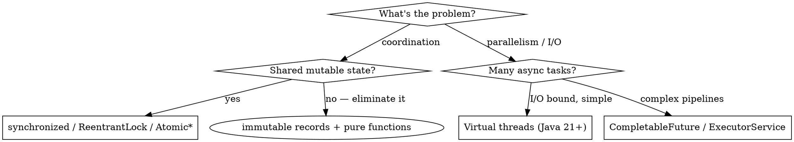

# Java Senior Dev

**REQUIRED BACKGROUND:** Apply all principles from `senior-dev` first. This skill adds Java-specific patterns on top.

## Overview

Senior Java means: **modern (Java 17+), typed correctly, designed with interfaces not implementations, and idiomatic with streams and optionals**. The gap from junior is mostly: raw types, mutable shared state, checked exception abuse, and using `null` where `Optional` belongs.

## Modern Java (17+) — Use These

| Feature | Use for |
|---------|---------|
| Records | Immutable value objects, DTOs — replaces `@Data` Lombok |
| Sealed classes + pattern matching | Closed type hierarchies (ADT), exhaustive `switch` |
| `Optional<T>` | Return types that may be absent — never as field or parameter |
| Text blocks | Multi-line strings (SQL, JSON, HTML) |
| `var` | Local variable type inference when type is obvious from RHS |
| Stream API | Data transformation pipelines — FP in Java |
| `instanceof` pattern matching | Eliminates cast boilerplate |

```java
// ❌ Junior: mutable DTO with getters/setters
public class UserDto {
    private String name;
    private String email;
    public String getName() { return name; }
    public void setName(String name) { this.name = name; }
}

// ✅ Senior: record (immutable, auto-equals/hashCode/toString)
public record UserDto(String name, String email) {}

// ❌ Junior: null check
if (user != null) {
    return user.getName();
}
return "unknown";

// ✅ Senior: Optional
return Optional.ofNullable(user)
    .map(User::getName)
    .orElse("unknown");

// ❌ Junior: instanceof + cast
if (shape instanceof Circle) {
    Circle c = (Circle) shape;
    return c.radius() * 2;
}

// ✅ Senior: pattern matching
if (shape instanceof Circle c) {
    return c.radius() * 2;
}
```

## OOP in Java: Interface-First Design

Apply `senior-dev` SOLID rules. Java-specific emphasis:

- **Program to interfaces, not implementations** — `List<T>` not `ArrayList<T>` in signatures
- **Sealed interfaces** for closed polymorphism (replaces enum+switch over type field)
- **Default methods** on interfaces for optional behavior — avoid abstract classes unless sharing state
- **Composition over inheritance** — use delegation; extend only when genuine IS-A

```java
// ❌ Inheritance for reuse
class BaseRepository {
    protected EntityManager em;
    public <T> T findById(Class<T> type, Long id) { ... }
}
class UserRepository extends BaseRepository { ... }

// ✅ Composition + interface
interface Repository<T, ID> {
    Optional<T> findById(ID id);
    T save(T entity);
}
class UserRepository implements Repository<User, Long> {
    private final EntityManager em;  // injected, not inherited
    ...
}

// ✅ Sealed interface for exhaustive modeling
sealed interface PaymentResult permits Success, Failure, Pending {}
record Success(String txId) implements PaymentResult {}
record Failure(String reason) implements PaymentResult {}
record Pending(String reference) implements PaymentResult {}

// switch is exhaustive — compiler enforces completeness
String message = switch (result) {
    case Success s -> "Paid: " + s.txId();
    case Failure f -> "Failed: " + f.reason();
    case Pending p -> "Pending: " + p.reference();
};
```

## FP in Java: Streams + Functional Interfaces

Use streams for data transformation pipelines. Keep stream operations **pure** (no side effects inside `map`/`filter`).

```java
// ❌ Imperative accumulation
List<String> names = new ArrayList<>();
for (User user : users) {
    if (user.isActive()) {
        names.add(user.getName().toUpperCase());
    }
}

// ✅ Stream pipeline — declarative, composable
List<String> names = users.stream()
    .filter(User::isActive)
    .map(User::getName)
    .map(String::toUpperCase)
    .toList();  // Java 16+ unmodifiable list

// ✅ Reusable predicates (FP composition)
Predicate<User> isActive = User::isActive;
Predicate<User> hasEmail = u -> u.email() != null;
Predicate<User> eligibleForNotification = isActive.and(hasEmail);

users.stream().filter(eligibleForNotification).forEach(notifier::send);
```

**Stream rules:**
- Never use `.forEach()` to accumulate — use `.collect()` or `.toList()`
- Prefer method references over lambdas when equivalent
- Side effects belong in `.forEach()` at the terminal end only, never in intermediate ops
- Use `parallelStream()` only after profiling — it has overhead and requires thread-safe operations

## Concurrency



- Prefer **immutability** to eliminate synchronization problems entirely
- `Atomic*` classes (`AtomicInteger`, `AtomicReference`) for simple counters/flags
- `ConcurrentHashMap` over `HashMap` + synchronized block
- Virtual threads (Java 21) for high-throughput I/O — drop-in for platform threads

## Exception Handling

```java
// ❌ Swallow
try {
    process(record);
} catch (Exception e) {
    // ignore
}

// ❌ Checked exceptions leaking through every layer
void save(User user) throws SQLException, IOException { ... }

// ✅ Wrap checked exceptions at boundaries; use unchecked internally
void save(User user) {
    try {
        repository.persist(user);
    } catch (SQLException e) {
        throw new RepositoryException("Failed to save user " + user.id(), e);
    }
}

// ✅ Result type for expected failures (no exception as control flow)
sealed interface Result<T> permits Result.Ok, Result.Err {
    record Ok<T>(T value) implements Result<T> {}
    record Err<T>(String message) implements Result<T> {}
}
```

**Rule:** Checked exceptions are for callers who **can meaningfully recover**. If they can't, wrap in a `RuntimeException`. Never use exceptions for control flow.

## Testing (JUnit 5 + Mockito)

```java
// Parametrized tests — data drives behavior (FP thinking)
@ParameterizedTest
@CsvSource({"hello,true", ",false", "null,false"})
void isValid(String value, boolean expected) {
    assertThat(validator.isValid(value)).isEqualTo(expected);
}

// Mock only at system boundaries
@ExtendWith(MockitoExtension.class)
class OrderServiceTest {
    @Mock PaymentGateway gateway;        // external boundary
    @InjectMocks OrderService service;   // domain logic under test

    @Test
    void chargesCustomerOnSuccess() {
        when(gateway.charge(any())).thenReturn(new ChargeResult("tx-123"));
        var result = service.placeOrder(anOrder());
        assertThat(result.txId()).isEqualTo("tx-123");
    }
}
```

Use **AssertJ** (`assertThat`) over raw JUnit assertions — richer failure messages, fluent API.

## Build Tooling

| Tool | Use when |
|------|----------|
| **Gradle (Kotlin DSL)** | New projects, multi-module, custom build logic |
| **Maven** | Existing corporate standard, simpler dependency management |
| **Spring Boot** | Web services, dependency injection, autoconfiguration |
| **Micronaut / Quarkus** | GraalVM native image, low startup time, serverless |

## Java-Specific Pitfalls

| Pitfall | Fix |
|---------|-----|
| Raw types (`List`, `Map`) | Always parameterize generics |
| `null` as sentinel value | Use `Optional<T>` for absent return values |
| `equals()` without `hashCode()` | Override both or neither (records do it automatically) |
| Mutable `Date`/`Calendar` | Use `java.time` (`LocalDate`, `Instant`, `ZonedDateTime`) |
| String concatenation in loops | Use `StringBuilder` or `String.join()` |
| Catching `Exception` or `Throwable` | Catch specific exceptions; let `Error` propagate |
| Static mutable state | Make it `final` + immutable or inject via DI |
| `finalize()` | Use `Closeable` + try-with-resources instead |
| Field injection (`@Autowired` on field) | Constructor injection — explicit, testable, final |

## Notes

- `record` + `sealed interface` replaces most uses of Lombok and hand-rolled value objects
- Constructor injection > field injection: dependencies are explicit, `final`, and testable without a container
- `Optional` is a return type, not a field type or parameter type
- `java.time` is the only acceptable date/time API; never use `Date` or `Calendar` in new code
