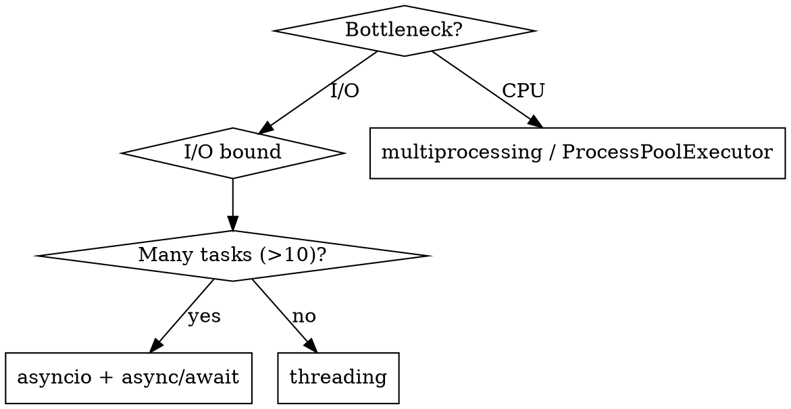

# Python Senior Dev

**REQUIRED BACKGROUND:** Apply all principles from `senior-dev` first. This skill adds Python-specific patterns on top.

## Overview

Senior Python means: **idiomatic, typed, testable, and operationally sound**. The gap from junior is mostly: mutable default traps, wrong concurrency model, and code that doesn't pass `mypy --strict`.

## Pythonic Patterns

```python
# ❌ Manual loop accumulation
result = []
for item in items:
    if item.active:
        result.append(item.name)

# ✅ Comprehension
result = [item.name for item in items if item.active]

# ❌ Dict existence check
if key in d:
    val = d[key]
else:
    val = default

# ✅
val = d.get(key, default)

# ❌ Mutable default argument (silent bug)
def append_to(element, to=[]):
    to.append(element)
    return to

# ✅
def append_to(element, to=None):
    if to is None:
        to = []
    to.append(element)
    return to

# ❌ Loads everything into memory
def read_records(path: str) -> list[dict]:
    return [parse(line) for line in open(path)]

# ✅ Stream with generator
def read_records(path: str) -> Iterator[dict]:
    with open(path) as f:
        for line in f:
            yield parse(line)
```

## Type Hints (Always in Production Code)

```python
from __future__ import annotations
from typing import TypeVar, Protocol, TypedDict
from collections.abc import Iterator, Sequence

# Prefer Protocol over ABC for structural typing (FP-friendly duck typing)
class Serializable(Protocol):
    def to_dict(self) -> dict[str, object]: ...

# TypeVar for generic functions
T = TypeVar("T")
def first(seq: Sequence[T]) -> T | None:
    return seq[0] if seq else None

# TypedDict for structured dicts (zero runtime overhead)
class UserRecord(TypedDict):
    id: int
    name: str
    email: str | None
```

Run `mypy --strict` and `ruff check` on every PR.

## OOP in Python: Prefer Protocol + Composition

Python's duck typing makes deep class hierarchies unnecessary. Apply `senior-dev` composition rules, but use Python-specific tools:

```python
# ❌ ABC inheritance — forces IS-A relationship
from abc import ABC, abstractmethod
class Storage(ABC):
    @abstractmethod
    def save(self, data): ...

# ✅ Protocol — structural typing, no inheritance needed
class Storage(Protocol):
    def save(self, data: bytes) -> None: ...

# Any class with a matching .save() satisfies Storage — no subclassing required
```

Use `@dataclass` for domain entities (OOP); use pure functions + generators for data pipelines (FP).

## Concurrency Decision



- Never mix `asyncio` with blocking calls — use `asyncio.to_thread()` inside async code
- `multiprocessing` sidesteps the GIL; `threading` does not (fine for I/O, useless for CPU)

## Data Structure Choice

| Use | When |
|-----|------|
| `@dataclass` | Mutable domain entities, needs methods, default values |
| `@dataclass(frozen=True)` | Immutable value objects, hashable — FP-style |
| `NamedTuple` | Lightweight immutable records, positional unpacking needed |
| `TypedDict` | Typing existing dicts (APIs, JSON), zero runtime overhead |
| `pydantic.BaseModel` | Validation at system boundaries only (HTTP input, config, CLI) |

## Testing Patterns (pytest)

```python
import pytest

# Parametrize — FP thinking applied to tests (data drives behavior)
@pytest.mark.parametrize("value,expected", [
    ("hello", True),
    ("", False),
    (None, False),
])
def test_is_valid(value, expected):
    assert is_valid(value) == expected

# Fixtures for stateful setup (OOP-style resource lifecycle)
@pytest.fixture
def db_session(tmp_path):
    session = create_session(tmp_path / "test.db")
    yield session
    session.close()

# Mock only at system boundaries — not internal functions
def test_send_email():
    with patch("myapp.email.smtplib.SMTP") as mock_smtp:
        send_welcome("user@example.com")
    mock_smtp.return_value.__enter__.return_value.sendmail.assert_called_once()
```

## Project Tooling (2024+)

| Tool | Purpose |
|------|---------|
| `uv` | Package manager + venv (replaces pip + virtualenv) |
| `ruff` | Linter + formatter (replaces flake8 + black + isort) |
| `mypy --strict` | Static type checking |
| `pytest` | Testing |
| `pyproject.toml` | Single config for all tools |

```toml
[tool.mypy]
strict = true

[tool.ruff]
line-length = 100
select = ["E", "F", "I", "UP", "B"]

[tool.pytest.ini_options]
testpaths = ["tests"]
```

## Python-Specific Pitfalls

| Pitfall | Fix |
|---------|-----|
| Mutable default argument | `None` sentinel, create inside function |
| Late binding in closures | `lambda x=x: x` captures value at definition |
| Catching bare `Exception` | Catch specific; re-raise with `from e` for context |
| `import *` | Always explicit imports |
| Circular imports | Restructure; use `TYPE_CHECKING` for type-only imports |
| `assert` for validation | Stripped by `-O`; use explicit `if` + `raise` |
| `%` or `.format()` strings | Use f-strings |
| `is` for equality | `is` = identity; `==` = equality |
| `__slots__` missing on hot-path classes | Add `__slots__` to reduce per-instance memory overhead |
