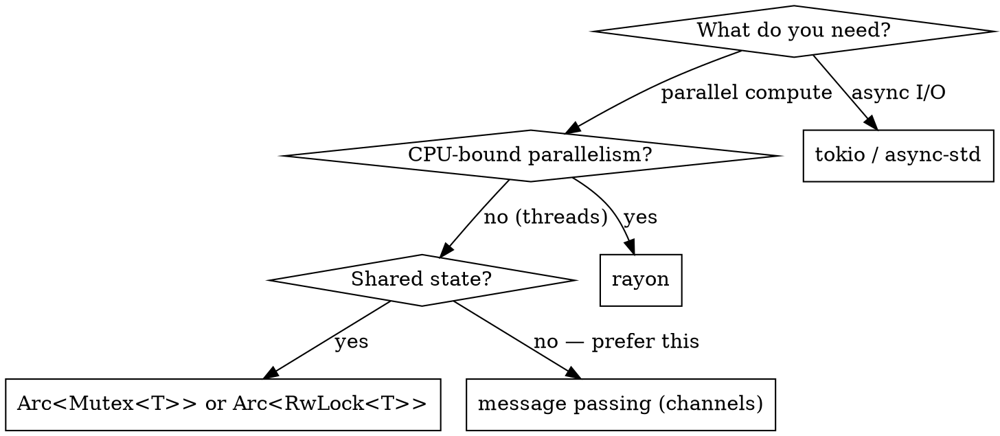

# Rust Senior Dev

**REQUIRED BACKGROUND:** Apply all principles from `senior-dev` first. This skill adds Rust-specific patterns on top.

## Overview

Senior Rust means: **let the compiler be your reviewer**. The ownership system, type system, and trait bounds are not obstacles — they are the design tool. The gap from junior is mostly: fighting the borrow checker instead of designing around it, misusing `clone()` and `unwrap()`, and reaching for `unsafe` before exhausting safe alternatives.

## Ownership — Design Around It, Don't Fight It

```rust
// ❌ Junior: clone to escape borrow issues
fn process(data: Vec<u8>) -> Vec<u8> {
    let copy = data.clone();   // unnecessary clone
    transform(data);
    copy
}

// ✅ Senior: think about who owns what
fn process(data: Vec<u8>) -> Vec<u8> {
    transform(&data);          // borrow, don't move
    data                       // return ownership to caller
}

// ❌ Storing reference in struct without understanding lifetime
struct Parser {
    input: &str,               // won't compile without lifetime annotation
}

// ✅ Own the data when lifetime is complex
struct Parser {
    input: String,             // own it — simpler, often correct choice
}

// ✅ Or use lifetime annotation when borrowing is truly needed
struct Parser<'a> {
    input: &'a str,            // explicit: Parser cannot outlive input
}
```

**Rule:** When in doubt, own the data (`String` over `&str`, `Vec<T>` over `&[T]`). Optimize to borrows only after profiling shows allocation is a bottleneck.

## Error Handling — Never `unwrap()` in Production

```rust
use std::fmt;

// ❌ Panic in production code
let config = std::fs::read_to_string("config.toml").unwrap();
let value: i32 = "abc".parse().unwrap();

// ✅ Propagate with ? operator
fn load_config() -> Result<Config, ConfigError> {
    let raw = std::fs::read_to_string("config.toml")?;
    let config: Config = toml::from_str(&raw)?;
    Ok(config)
}

// ✅ Custom error type with thiserror
use thiserror::Error;

#[derive(Debug, Error)]
enum ConfigError {
    #[error("failed to read config file: {0}")]
    Io(#[from] std::io::Error),
    #[error("invalid config format: {0}")]
    Parse(#[from] toml::de::Error),
    #[error("missing required field: {field}")]
    MissingField { field: String },
}

// ✅ anyhow for application code (binaries), thiserror for library code
// Application (binary): use anyhow::Result for ergonomic error propagation
// Library (crate): define typed errors with thiserror so callers can match
```

**Rule:** `unwrap()` is only acceptable in tests, examples, and when a `None`/`Err` is truly unreachable and you've commented why.

## Traits — Rust's Polymorphism

Traits are both OOP interfaces AND FP type classes in Rust. Apply `senior-dev` interface-first design using traits.

```rust
// ✅ Program to traits, not concrete types (Dependency Inversion)
trait Storage {
    fn save(&self, key: &str, value: &[u8]) -> Result<(), StorageError>;
    fn load(&self, key: &str) -> Result<Vec<u8>, StorageError>;
}

struct FileStorage { root: PathBuf }
struct S3Storage { bucket: String, client: S3Client }

impl Storage for FileStorage { ... }
impl Storage for S3Storage { ... }

// Static dispatch (zero cost, monomorphized)
fn process<S: Storage>(storage: &S, data: &[u8]) -> Result<()> { ... }

// Dynamic dispatch (runtime cost, needed for trait objects in collections)
fn process_dyn(storage: &dyn Storage, data: &[u8]) -> Result<()> { ... }
```

**Static vs dynamic dispatch:**
- Prefer `impl Trait` / `<T: Trait>` (static) — zero runtime cost, enables inlining
- Use `dyn Trait` (dynamic) only when you need heterogeneous collections or object safety

### Key Standard Traits to Implement

| Trait | Implement when |
|-------|---------------|
| `Display` | Human-readable output (`println!("{}", val)`) |
| `Debug` | Always — derive it: `#[derive(Debug)]` |
| `Clone` | Derive only when cheap; add `Copy` if stack-only |
| `From` / `Into` | Type conversions — enables `?` operator |
| `Iterator` | Custom sequence types |
| `Default` | Zero/empty value makes sense |
| `PartialEq` / `Eq` | Equality — derive if all fields support it |
| `Hash` | Needed for `HashMap` keys |
| `Send` / `Sync` | Auto-implemented; understand when they're NOT |

## FP Patterns in Rust

Rust's iterator combinators are idiomatic — prefer them over explicit loops.

```rust
// ❌ Explicit loop accumulation
let mut names = Vec::new();
for user in &users {
    if user.active {
        names.push(user.name.to_uppercase());
    }
}

// ✅ Iterator combinators — lazy, composable, zero-cost abstraction
let names: Vec<String> = users.iter()
    .filter(|u| u.active)
    .map(|u| u.name.to_uppercase())
    .collect();

// ✅ Chain combinators for complex pipelines
let total: u64 = orders.iter()
    .filter(|o| o.status == Status::Paid)
    .flat_map(|o| o.items.iter())
    .map(|item| item.price * item.qty)
    .sum();

// ✅ Option combinators — FP over nullable values
let name = user
    .and_then(|u| u.profile)
    .map(|p| p.display_name.clone())
    .unwrap_or_else(|| "anonymous".to_string());
```

## Concurrency — Fearless but Thoughtful



```rust
// ✅ Prefer message passing over shared state (channels)
use std::sync::mpsc;
let (tx, rx) = mpsc::channel::<WorkItem>();

// ✅ Rayon for data parallelism — par_iter() is drop-in
use rayon::prelude::*;
let results: Vec<_> = data.par_iter().map(|x| expensive(x)).collect();

// ✅ Async with tokio — use spawn for independent tasks
#[tokio::main]
async fn main() -> anyhow::Result<()> {
    let handle = tokio::spawn(async move { fetch_data().await });
    let result = handle.await??;
    Ok(())
}
```

**Rules:**
- `Mutex` poisoning is a real risk — use `.unwrap()` on lock only when you know no thread can panic while holding it; otherwise handle `PoisonError`
- Never block inside async code — use `tokio::task::spawn_blocking` for CPU or blocking I/O
- `Arc<Mutex<T>>` for shared mutable state; `Arc<T>` for shared immutable state

## `unsafe` — Last Resort

```rust
// ❌ Reaching for unsafe to "just make it work"
unsafe {
    let ptr = &data[0] as *const u8;
    // ...
}

// ✅ Exhaust safe alternatives first:
// 1. Redesign ownership to avoid the need
// 2. Use safe abstractions: slice::split_at, Cell<T>, RefCell<T>
// 3. Check crates.io for a safe wrapper
// 4. Only then: narrow unsafe to minimum scope + document invariants

// ✅ When unsafe is necessary, isolate and document
/// # Safety
/// Caller must ensure `ptr` is valid and aligned for `T`,
/// and that the lifetime of the returned reference does not exceed
/// the lifetime of the allocation behind `ptr`.
unsafe fn read_field<T>(ptr: *const T) -> &'static T {
    &*ptr
}
```

## API Design

```rust
// ✅ Builder pattern for complex construction
let server = Server::builder()
    .port(8080)
    .timeout(Duration::from_secs(30))
    .max_connections(1000)
    .build()?;

// ✅ Typestate pattern — enforce valid state transitions at compile time
struct Locked;
struct Unlocked;

struct Vault<State> {
    contents: Vec<u8>,
    _state: PhantomData<State>,
}

impl Vault<Locked> {
    fn unlock(self, key: &Key) -> Result<Vault<Unlocked>, AuthError> { ... }
}
impl Vault<Unlocked> {
    fn read(&self) -> &[u8] { &self.contents }
    fn lock(self) -> Vault<Locked> { ... }
}
// Vault<Locked>.read() is a compile error — illegal states unrepresentable
```

## Tooling

| Tool | Purpose |
|------|---------|
| `cargo clippy` | Linter — treat warnings as errors in CI (`-D warnings`) |
| `cargo fmt` | Formatter — enforce with `--check` in CI |
| `cargo test` | Unit + integration tests |
| `cargo bench` | Microbenchmarks with Criterion |
| `cargo audit` | Security audit of dependencies |
| `cargo deny` | License + duplicate dependency policy |
| `miri` | Undefined behavior detection in unsafe code |
| `flamegraph` / `perf` | CPU profiling |

**`Cargo.toml` profile for releases:**
```toml
[profile.release]
lto = true           # link-time optimization
codegen-units = 1    # slower compile, faster binary
panic = "abort"      # smaller binary, no unwinding
```

## Rust-Specific Pitfalls

| Pitfall | Fix |
|---------|-----|
| `clone()` to escape borrow checker | Redesign ownership; clone only when truly needed |
| `unwrap()` / `expect()` in non-test code | Use `?`, `if let`, `match`, or return `Result` |
| Lifetime annotations on everything | Usually a sign of wrong ownership model — own the data |
| `Box<dyn Error>` in library API | Define typed errors with `thiserror`; `Box<dyn Error>` is for binaries |
| `Vec::push` inside hot loop without `reserve` | Pre-allocate: `Vec::with_capacity(n)` |
| Blocking in async context | Use `tokio::task::spawn_blocking` for blocking calls |
| Large enum variants (memory bloat) | Box large variants: `Box<LargeStruct>` |
| `String` vs `&str` confusion | `&str` for function params (accepts both); `String` for owned storage |
| Mutex deadlock via nested locks | Establish lock ordering; prefer channels; minimize lock scope |
| Ignoring `#[must_use]` on `Result` | Never silently discard `Result` — use `let _ = ...` if intentional |

## Notes

- The borrow checker is your pair reviewer — when it rejects code, the code usually has a real problem
- Rust's zero-cost abstractions mean iterator chains compile to the same code as hand-written loops
- `anyhow` for binaries, `thiserror` for libraries — this distinction matters for your users
- Enable `#![deny(clippy::all, clippy::pedantic)]` in library crates
- `cargo clippy -- -D warnings` in CI; never ship with unaddressed lints
- Measure before optimizing — Rust is fast by default; premature optimization hides design flaws
