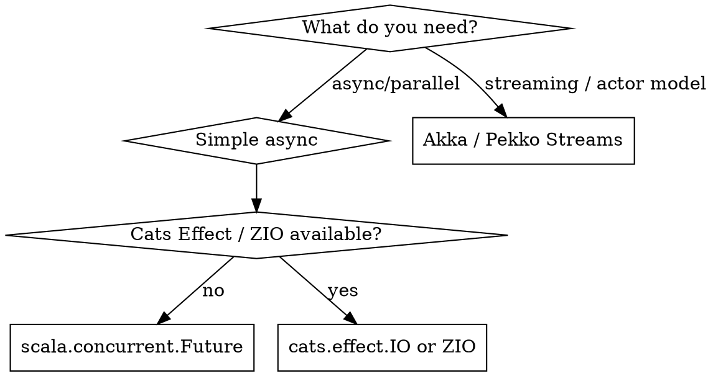

# Scala Senior Dev

**REQUIRED BACKGROUND:** Apply all principles from `senior-dev` first. This skill adds Scala-specific patterns on top.

## Overview

Scala uniquely unifies OOP and FP. Senior Scala means: **model your domain with types, transform data with pure functions, handle effects explicitly, and let the compiler find your bugs**. The gap from junior is mostly: using `null`/exceptions instead of `Option`/`Either`, `var` instead of `val`, mutable collections, and missing the type system as a design tool.

## OOP in Scala: Traits + Sealed Hierarchies

Apply `senior-dev` SOLID and composition rules. Scala-specific emphasis:

- **Traits** over abstract classes — traits are composable, abstract classes are for JVM interop or constructor params
- **Sealed traits/enums** for closed type hierarchies — compiler enforces exhaustive matching
- **Case classes** for value objects — auto-generates `equals`, `hashCode`, `copy`, `unapply`
- **Companion objects** for factory methods and type class instances, not utility dumping grounds

```scala
// ❌ Java-style inheritance
abstract class Animal {
  def sound(): String
}
class Dog extends Animal {
  def sound() = "woof"
}

// ✅ Sealed trait hierarchy — exhaustive, composable
sealed trait Animal
case class Dog(name: String) extends Animal
case class Cat(name: String) extends Animal

def describe(a: Animal): String = a match {
  case Dog(n) => s"$n says woof"
  case Cat(n) => s"$n says meow"
  // compiler error if a new subtype is added and not handled
}

// ✅ Trait composition (mixins) over multi-level inheritance
trait Auditable:
  def auditLog: List[String]

trait Persistable[T]:
  def save(entity: T): Either[String, T]

class UserRepository extends Persistable[User] with Auditable:
  ...
```

## FP in Scala: The Core Idioms

Scala's FP is the primary style. Use OOP for structure; FP for all data transformation.

### Immutability First

```scala
// ❌ var and mutable state
var total = 0
for (item <- items) total += item.price

// ✅ fold — pure, no mutation
val total = items.foldLeft(0)(_ + _.price)

// ❌ mutable collection
val result = scala.collection.mutable.ListBuffer[String]()
for (u <- users if u.active) result += u.name

// ✅ immutable pipeline
val result = users.filter(_.active).map(_.name)
```

### Option / Either / Try — Never null, Never throw

```scala
// ❌ null and exceptions for control flow
def findUser(id: Long): User = {
  val user = db.find(id)
  if (user == null) throw new RuntimeException("not found")
  user
}

// ✅ Option for absence, Either for failures with reason
def findUser(id: Long): Option[User] = db.find(id)

def loadConfig(path: String): Either[String, Config] =
  Try(parseFile(path)).toEither.left.map(_.getMessage)

// ✅ For-comprehension chains — flatMap without nesting
val result: Either[String, Invoice] = for
  user    <- findUser(userId).toRight("user not found")
  account <- findAccount(user.accountId).toRight("account missing")
  invoice <- createInvoice(account)
yield invoice
```

### Type Classes — FP Polymorphism (Scala 3 `given`/`using`)

```scala
// Type class definition
trait Encoder[A]:
  def encode(value: A): String

// Instances (given replaces Scala 2 implicit val)
given Encoder[User] with
  def encode(u: User) = s"${u.id}:${u.name}"

given Encoder[Int] with
  def encode(n: Int) = n.toString

// Usage (using replaces Scala 2 implicit parameter)
def serialize[A](value: A)(using enc: Encoder[A]): String =
  enc.encode(value)

// Extension methods (replaces Scala 2 implicit class)
extension [A](value: A)(using enc: Encoder[A])
  def encoded: String = enc.encode(value)

// Usage reads naturally
user.encoded
42.encoded
```

## Scala 3 Features — Prefer These

| Feature | Replaces | Use for |
|---------|----------|---------|
| `enum` | `sealed trait` + `case object` | ADTs, enumerations with methods |
| `given` / `using` | `implicit val` / `implicit` param | Type class instances, context passing |
| `extension` | `implicit class` | Adding methods to existing types |
| Opaque types | Value classes | Zero-cost type safety wrappers |
| `|` union types | `Either[A, B]` for simple unions | Multi-type parameters |
| Top-level definitions | Object wrappers | Utility functions without boilerplate |
| Indentation syntax | Braces | Cleaner code (optional but idiomatic) |

```scala
// ✅ Opaque type — zero runtime cost, full type safety
opaque type UserId = Long
object UserId:
  def apply(n: Long): UserId = n
  extension (id: UserId) def value: Long = id

// ✅ Enum with ADT behavior
enum PaymentResult:
  case Success(txId: String)
  case Failure(reason: String)
  case Pending(reference: String)
```

## Concurrency / Effects



- **`Future`** is eager and memoized — starts running on creation; difficult to test and compose
- **`cats.effect.IO` / `ZIO`** are lazy descriptions of effects — composable, testable, referentially transparent
- Prefer `IO`/`ZIO` for new code; wrap `Future` with `.fromFuture` at boundaries
- Never block inside an effect (`Await.result`, `Thread.sleep`) — use `IO.sleep` or fiber semantics

```scala
// ❌ Future — eager, mixes I/O and computation
val result: Future[User] = Future {
  Thread.sleep(100)  // blocks thread pool!
  db.findUser(id)
}

// ✅ Cats Effect IO — lazy, non-blocking, composable
val result: IO[User] = for
  _    <- IO.sleep(100.millis)
  user <- IO.blocking(db.findUser(id))  // explicit blocking context
yield user
```

## Collections — Immutable by Default

```scala
// Always import immutable explicitly if shadowed
import scala.collection.immutable.{Map, Set, List}

// Prefer List for sequential, Vector for indexed, Map for lookup
val names: List[String]   = List("a", "b")
val index: Map[Int, User] = Map(1 -> user1, 2 -> user2)

// For-comprehension over nested maps/filters
val pairs = for
  x <- 1 to 3
  y <- 1 to 3
  if x != y
yield (x, y)
```

## Testing (ScalaTest / MUnit + ScalaCheck)

```scala
// MUnit — lightweight, modern
class OrderServiceSuite extends munit.FunSuite:
  test("calculates total with discount"):
    val order = Order(items = List(Item("book", 10), Item("pen", 2)))
    assertEquals(order.total(discount = 0.1), 10.8)

// Property-based testing with ScalaCheck
property("encode/decode roundtrip"):
  forAll { (user: User) =>
    decode(encode(user)) == Right(user)
  }
```

Mock at system boundaries only. Domain logic should be pure functions — test them without mocks.

## Build Tooling

| Tool | Use when |
|------|----------|
| **sbt** | Standard for most Scala projects, rich plugin ecosystem |
| **scala-cli** | Scripts, single-file programs, quick experiments |
| **Mill** | Alternative to sbt, faster, simpler build definition |

## Scala-Specific Pitfalls

| Pitfall | Fix |
|---------|-----|
| `var` for local accumulation | Use `foldLeft`, `map`, `collect` |
| `null` anywhere | `Option[T]`; enable `-Yexplicit-nulls` in Scala 3 |
| Throwing exceptions in domain logic | `Either[Error, A]` or `Try[A]` |
| `implicit` everywhere (Scala 2 style) | Scope with `given`/`using`; name instances explicitly |
| Mutable collections (`ListBuffer`, `ArrayBuffer`) | Use immutable + functional transforms; mutate only in tight loops where profiling shows need |
| `Future` without `ExecutionContext` discipline | Always pass explicit `ExecutionContext`; never use `global` in production |
| Pattern match without sealed | Non-exhaustive match = runtime `MatchError`; always seal hierarchies |
| Overusing for-comprehension for non-monadic code | Plain `map`/`flatMap` or `fold` is clearer for simple cases |
| Deep class hierarchies with traits | Max 2-3 trait layers; prefer composition |

## Notes

- Scala's power is the type system — use it to make illegal states unrepresentable
- `case class` + `sealed trait` is the foundation of domain modeling; reach for it first
- FP and OOP are not in tension in Scala — OOP defines structure, FP defines behavior
- `given`/`using` (Scala 3) makes type classes readable; avoid `implicit` conversions entirely
- Enable `-Xfatal-warnings` and `-deprecation` in `scalacOptions`
