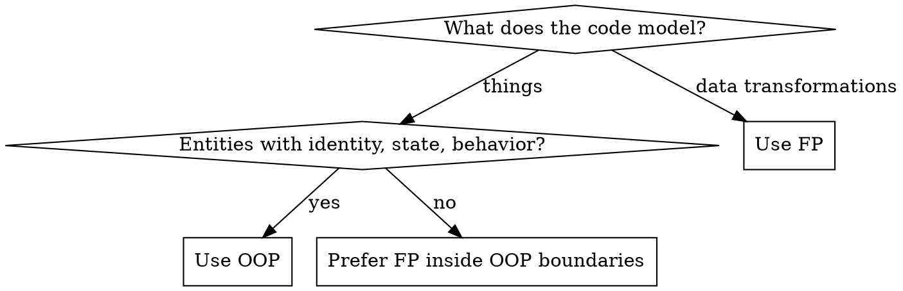

# Senior Dev

## Overview

Senior development is not about knowing more syntax — it's about **knowing what to leave out**, choosing the right paradigm for the problem, and writing code your team can maintain at 3am under pressure. The best code is the code that doesn't surprise future readers.

## Paradigm Decision: OOP vs FP



**Heuristic:** Model your domain with OOP (User, Order, Repository). Transform your data with FP (pipelines, mapping, filtering). Most production systems need both.

---

## OOP: When and How

### Use OOP when:
- You're modeling domain entities with identity (`User`, `Invoice`, `Device`)
- Behavior belongs naturally to the data it operates on
- You need polymorphism to swap implementations (Strategy, Repository pattern)
- You're managing lifecycle and state (connection pools, session objects)

### SOLID — the non-negotiable rules

| Principle | Rule | Violation symptom |
|-----------|------|-------------------|
| **S**ingle Responsibility | One reason to change | Class has `parseAndSaveAndNotify()` |
| **O**pen/Closed | Open for extension, closed for modification | Every new feature adds an `if` to existing code |
| **L**iskov Substitution | Subtypes must be substitutable | Override throws `NotImplemented` |
| **I**nterface Segregation | Small focused interfaces | Implementors leave methods empty/throw |
| **D**ependency Inversion | Depend on abstractions | `new ConcreteService()` deep inside domain logic |

### Composition over Inheritance

```python
# ❌ Deep inheritance — fragile, hard to reason about
class Animal:
    def breathe(self): ...
class Mammal(Animal):
    def nurse(self): ...
class Dog(Mammal):
    def bark(self): ...
class GuideDog(Dog):  # now what if we need GuideCat?
    def guide(self): ...

# ✅ Composition — flexible, testable
class Dog:
    def __init__(self, guide_behavior=None):
        self.guide_behavior = guide_behavior
    def guide(self):
        if self.guide_behavior:
            self.guide_behavior.execute(self)
```

**Rule:** Prefer max 2 levels of inheritance. If you need 3+, redesign with composition.

### Avoid These OOP Traps

| Trap | Fix |
|------|-----|
| God class (knows everything, does everything) | Split by responsibility; each class should fit in your head |
| Anemic domain model (data bags + service classes) | Move behavior onto the entity that owns the data |
| Inheritance for code reuse | Use composition or mixins; inheritance is for IS-A relationships |
| Leaking implementation through public API | Hide internals; expose only what callers need |
| Mutable shared state | Make objects immutable by default; mutate explicitly |

---

## FP: When and How

### Use FP when:
- You're transforming data (ETL pipelines, request/response processing)
- You want predictable, testable functions with no side effects
- You're handling collections (map, filter, reduce)
- Concurrency is involved (pure functions are inherently thread-safe)

### Core FP Principles

**Pure functions** — same input, same output, no side effects:
```python
# ❌ Impure — depends on external state
def get_discount(user):
    if datetime.now().weekday() == 0:  # Monday
        return user.base_price * 0.9
    return user.base_price

# ✅ Pure — all inputs explicit
def get_discount(base_price: float, is_monday: bool) -> float:
    return base_price * 0.9 if is_monday else base_price
```

**Immutability** — never mutate input data:
```python
# ❌ Mutates caller's data
def normalize(records):
    for r in records:
        r["name"] = r["name"].strip()
    return records

# ✅ Returns new data
def normalize(records):
    return [{**r, "name": r["name"].strip()} for r in records]
```

**Function composition** — build complex behavior from small pure functions:
```python
from functools import reduce

def pipeline(*fns):
    return lambda x: reduce(lambda v, f: f(v), fns, x)

process = pipeline(parse, validate, normalize, enrich)
result = process(raw_input)
```

**Higher-order functions** over explicit loops:
```python
# ❌ Imperative
totals = []
for order in orders:
    if order.status == "paid":
        totals.append(order.amount * TAX_RATE)

# ✅ Declarative FP
totals = [o.amount * TAX_RATE for o in orders if o.status == "paid"]

# Or with generators for large datasets
totals = (o.amount * TAX_RATE for o in orders if o.status == "paid")
```

### Avoid These FP Traps

| Trap | Fix |
|------|-----|
| Hidden side effects in "pure" functions | If it logs, writes, or calls external services — it's impure. Make it explicit. |
| Over-abstracting with monads in non-FP languages | Use Result/Option types only where error-as-value genuinely simplifies flow |
| Chaining too deep (unreadable one-liners) | Break into named intermediate steps |
| Mutating loop variables | Use map/filter/reduce; if you need a loop, don't mutate outside it |

---

## Universal Senior Principles

### Abstraction levels must be consistent

```python
# ❌ Mixed levels — reads like a recipe mixed with chemistry
def process_order(order):
    user = db.query("SELECT * FROM users WHERE id = ?", order.user_id)
    if user and user["email_verified"]:
        send_confirmation(order)

# ✅ Consistent level — each line at the same altitude
def process_order(order):
    user = user_repository.find(order.user_id)
    if user.can_receive_notifications():
        notification_service.send_confirmation(order)
```

### Name things at the right level

| Bad name | Good name | Why |
|----------|-----------|-----|
| `data`, `info`, `obj` | `invoice`, `user_session` | Names should encode intent |
| `doStuff()`, `process()` | `recalculate_tax()`, `archive_order()` | Verbs should be specific |
| `flag`, `temp`, `val` | `is_expired`, `retry_count` | Boolean/numeric semantics |
| `Manager`, `Helper`, `Utils` | `OrderRepository`, `TaxCalculator` | Classes with clear responsibility |

### Error handling

```python
# ❌ Swallow and hide
try:
    result = risky_operation()
except Exception:
    pass

# ❌ Catch-all with log only
except Exception as e:
    logger.error(e)  # caller has no idea this failed

# ✅ Catch specific, handle or re-raise with context
except NetworkTimeout as e:
    raise RetryableError("Payment gateway timeout") from e
except ValidationError as e:
    return Err(f"Invalid input: {e}")  # caller-visible failure
```

### Design for testability

Code that's hard to test is hard to reason about. If you can't write a unit test without a database or HTTP call, your boundaries are wrong.

- **Inject dependencies** — don't instantiate services inside business logic
- **Separate I/O from logic** — pure transformation functions are trivially testable
- **Small, focused functions** — test one behavior per test

### Complexity budget

Every abstraction has a cost. Before adding one, ask:
- Will this be used in 3+ places? (If not, it's premature)
- Does it reduce total cognitive load or just move it?
- Can a future reader understand it in 30 seconds?

**Default to flat and explicit. Earn abstractions.**

---

## Code Review Checklist (Senior Lens)

- [ ] Can I understand this function without reading its callees?
- [ ] Are abstractions at a consistent level?
- [ ] Is state mutation explicit and minimal?
- [ ] Are error cases handled — not just happy path?
- [ ] Does the name say *what*, not *how*?
- [ ] Is there a test that would catch a regression?
- [ ] Is this the simplest design that satisfies current requirements?

## Notes

- OOP and FP are not opposites — they're tools. Use OOP for structure, FP for transformations.
- The goal of all abstractions is to reduce the amount of code a reader must hold in their head at once.
- "Clever" code is a liability. "Boring" code is an asset.
- Write for the developer who will debug this at 2am — it's probably you.
